#### 07/03/2023
#### Joshua Edelstein

# Pnuemonia Analysis
## Overview
According to the World Health Organization (WHO), pneumonia kills around two million children under five years old every year and therefore is consistently estimated as the single leading cause of childhood mortality (Rudan et al., 2008). The WHO reports that 95% of new cases of pneumonia occur in developing countries, particularly in Southeast Asia and Africa. 
Bacterial and viral pathogens are the two leading causes of pneumonia (Mcluckie, 2009) yet require very different forms of management. Bacterial pneumonia requires urgent antibiotic treatment, while viral pneumonia is treated with supportive care. Therefore, accurate and timely diagnosis is imperative. A key part of the diagnosis is based on chest X-rays as they are routinely obtained and can help differentiate between the different types of pneumonia. However, the areas that struggle with childhoold pneumonia are lacking in doctors to interpret the xrays.[[1]](#cite_note-1)

[^1]: [Data from Cell.com](https://www.cell.com/cell/fulltext/S0092-8674(18)30154-5)

## Business Understanding 
The WHO has come to us to find a solution. Given the issue at hand, there are two possible approaches. The first is to have many qualified doctors on hand to read all the xrays that are coming in and suggest a course of treatment. However, being that there are many xrays this can be extremely time consuming, costly, and we may not have the requisite amount of doctors volunteering to do so. 

Therefore we will create a model that identifies whether a patient has pneumonia in general or not. If the model makes a positive prediction for pneumonia the xray will be passed over to a doctor to read whether the patient indeed has pneumonia and if they do, whether it is bacterial or viral. This method will cut down on the number of doctors required as they no longer have to read all the xrays; rather only the xrays that have been predicted positive. Our goal is to create the model for use by the doctors in these countries.

It's important to think about whether false positives or false negatives are worse in this case. A false positive means that the model predicts that the xray has pneumonia when it really doesn't. This may lead to providing treatment for a patient when it is not necessary. While a false negative means that the model predicts that the patient doesn't have pneumonia when he really does. This would mean not giving a patient treatment when they do need it. Being that we have a safety net of doctors reading the positive xrays, we don't need to be concerned for false positives nearly as much as false negatives, as the doctors will read all the xrays that are predicted positive. As such we will want to have a recall as high as possible so we catch all the patients with pneumonia.

Photo by <a href="https://unsplash.com/@nci?utm_source=unsplash&utm_medium=referral&utm_content=creditCopyText">National Cancer Institute</a> on <a href="https://unsplash.com/s/photos/x-ray?utm_source=unsplash&utm_medium=referral&utm_content=creditCopyText">Unsplash</a>
  

## Data Understanding and Preprocessing
This public dataset of 5,856 X-Ray images is provided by Mendeley data. The dataset is organized into 3 folders (train, test, val) and contains subfolders for each image category (Pneumonia/Normal). The  pneumonia images are a labeled mix of bacterial or viral. 

The X-ray images were taken in 2017 from cohorts of pediatric patients between one to five years old from the Guangzhou Women and Children’s Medical Center in Guangzhou, China. All chest xrays were initially screened for quality control by removing all low quality or unreadable scans. The diagnoses for the images were then graded by three expert physicians.[[2]](#cite_note-2)

[^2]: [Data from Mendeley Data](https://data.mendeley.com/datasets/rscbjbr9sj/2)

We began by performing some basic EDA.

We found that we had 3 datasets: Train, Test, Val. We used filepaths to load up the dataframes with their corresponding labels. The train set had 5216 chest xrays, test had 624 test xrays, and val had 16. Being that the validation set was so small, we decided to create a new validation set using a `train_test_split` on the train set. This resulted in new train that had 4277 xrays and a new val that had 939 xrays. 

Here is the breakdown of xrays with pneumonia in all 3 sets:

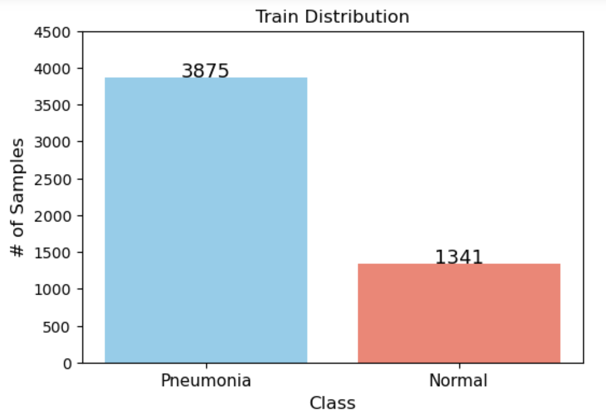

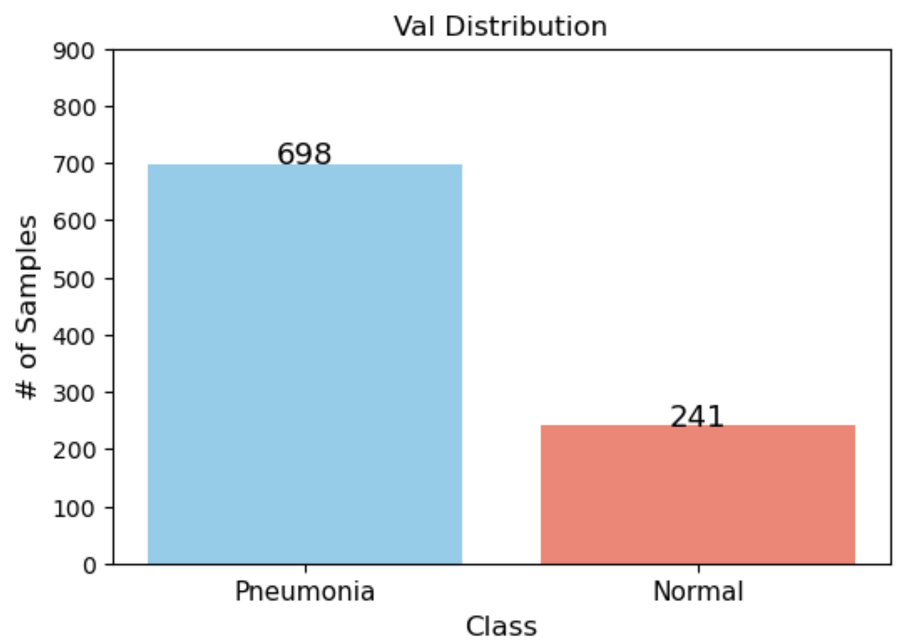

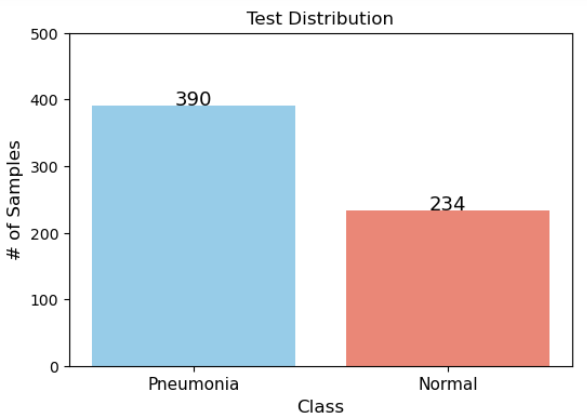

And here is a summary of the above: 

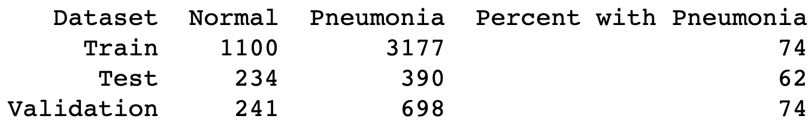

We also pulled up sample images from the train set of Normal/ Healthy patients. 

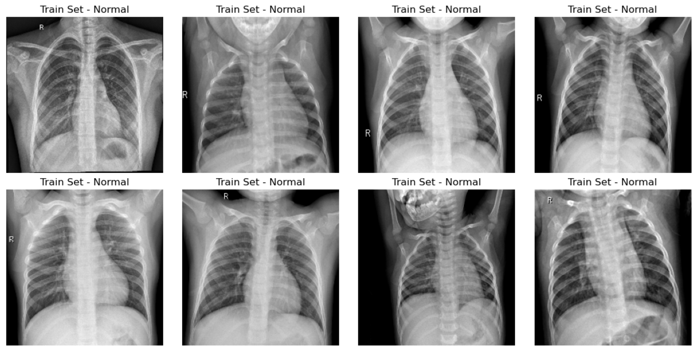

And here are some xrays with Pneumonia: 

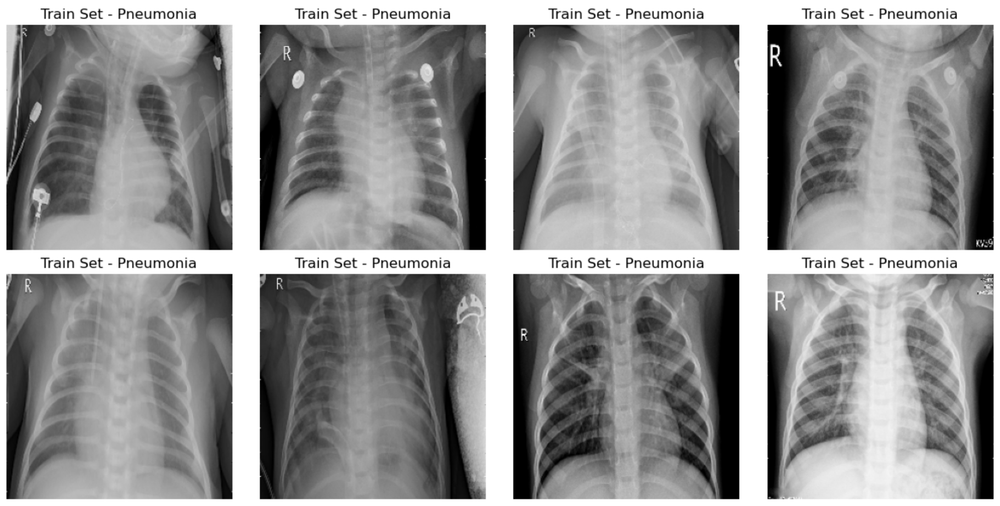

## Modeling 

### Baseline Model
For our baseline model we created a very simple model. We loaded up the data with `ImageDataGenerator()` and `flow_from_directory()`. We then reshaped the images and labels, to make sure the model would run properly. Finally, we created our model as a sequential model, where one layer would build on the next. It had a Dense input layer with 64 units and used `'relu'` activation. As well as a Dense output layer with `'sigmoid`' activation and one output. We then compiled the model with a `'SGD'` optimizer, loss of `'binary crossentropy'` and accuracy as our metric. We then created an `early stopping` parameter for our model if the results were not improving after 5 epochs. As mentioned earlier, being that the most important metric for us is recall, we monitored the models loss in the stop parameter, as the better the model the lower the recall.

Here is how our model scored on the testing set:

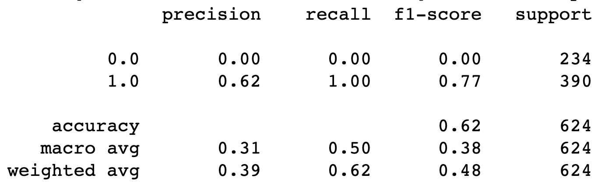

Interestingly the recall is 100% while the precision and accuracy are exactly the same and also happen to be the exact same as the percentage of xrays with pnuemonia in the testing set. It seems as though the model is just predicting every single xray as pneumonia. Clearly this isn't a very good model at all. 

### Final Model

For our final model we used a convolutional neural network with transfer learning. The specific model we used was a preloaded model from keras call ResNet, which is short for Residual Network. ResNet is a a type of convolutional neural network that uses a skip connection to create a more direct path for gradient flow during backpropagation. This allows the earlier layers to receive stronger gradient signals, leading to an improved training of the network.

Here are the results of our final model:

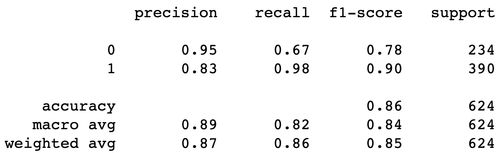

Additionally, this model had a loss of .35 and a ROC score of .96.

All of our models had very strong recall scores; however, this model scored higher than previous models in all other metrics, making it an easy decision. 

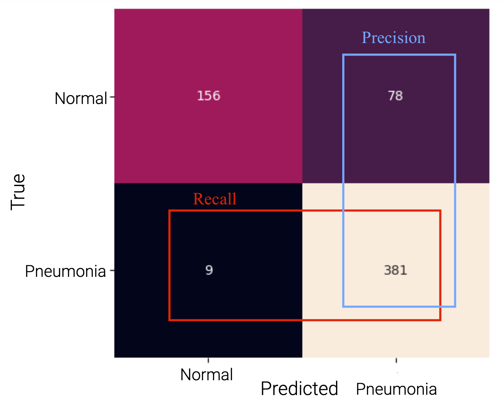

The model was tested on 624 patients, there were 390(9+381) patients who had pneumonia. The model correctly predicted the pneumonia status of 537(156+381) patients, this gives us the accuracy score we saw above of 86%. The model correctly captured 381 of the 390 patients who had pneumonia, giving us the recall score of 98%. The model incorrectly predicted that 78 patients had pneumonia, which gave us a precision score of 83%. The recall and precision scores were combined to give us an f1 score of .9.

We then proceeded to use LIME to evaluate our model.

#### Lime Evaluation
LIME helps us see the important factors behind a model's prediction for a particular instance. First, we'll test it out on an image with Pneumonia, and then an image without. In both examples it'll show us the percent chance that it is a Pneumonia xray.

The model predicted that the below image had Pneumonia with 99% certainty.

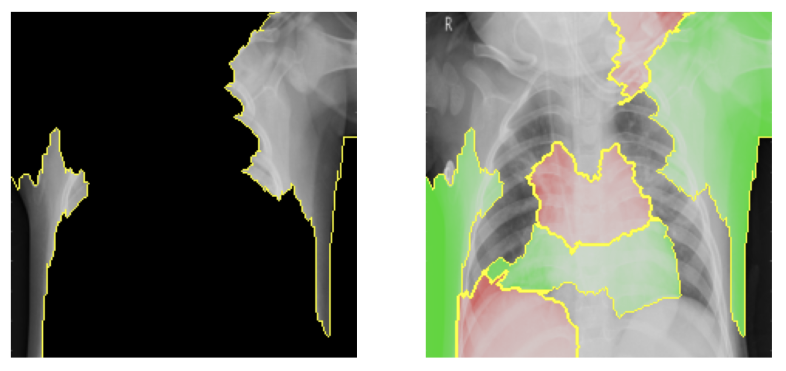

The areas showing in the axis on the left display the top 5 most important features that the model looks at. The area on the right displays the top 10 most important features, the green are the positive features(meaning it's more likely a patient has pneumonia), and the red is the negative. Based on the image on the left, it seems as though the top 5 most important features are not even in the chest cavity. It seems as though the model isn't focusing on the right area. However, this is not so alarming for a few reasons. We see from the image on the right, that areas in the chest cavity are still within the top 10 most important features, and thus are taken into consideration. Additionally, in our particular case we want the recall to be higher, so it is not an issue if the model slightly overpredicts pneumonia. This is especially since our model does take into account areas within the chest cavity within the top 10 most important features.

The model then predicted that this next image contains pneumonia with .1% certainty, meaning that it is most likely a normal/ healthy xray.

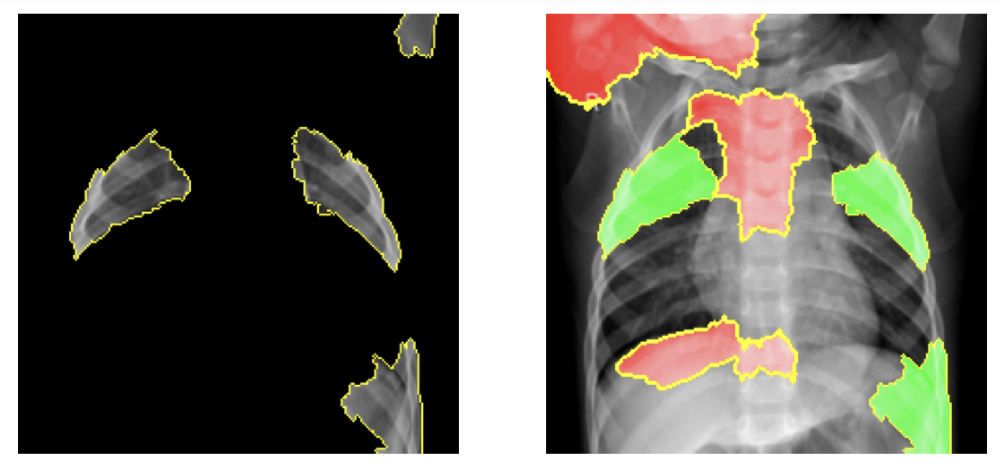

This is a good sign as most of the top factors are in the chest cavity.

## Conclusion
We will now sum up our findings from our analysis and modeling:

1. Model Type: Convolution Neural Network Transfer Learning model
- The specific model we used was a preloaded model from keras call ResNet, which is short for Residual Network. ResNet is a a type of convolutional neural network that uses a skip connection to create a more direct path for gradient flow during backpropagation. This allows the earlier layers to receive stronger gradient signals, leading to an improved training of the network. 
2. Model Scoring:
- F1-score of .9
- Recall of 98%
- Accuracy of 86%
- Precision of 83%
- Loss of .35
- ROC score of .96
3. Model Choice:
- We can see the tremendous improvement in all areas of our final model to our baseline model, as our baseline model just predicted every patient had pneumonia. 

## Recommendations
We recommend that the WHO puts our model into effect immediately. This would lower the amount of x-rays that would need to be checked by doctors, and allow the WHO to cut its costs. Additional recommendations would be to have doctors attempt to take a quick glance at the xrays that were normal, just to confirm, and attempt to catch the last 2 percent of people that slip through the model. 

## Limitations
The limitations on this model is that it was produced and testing on a relatively small amount of data. In that around 6000 xrays in the overall dataset and 624 patients in the testing set is not very significant. Although it may take more time and resources, the model should be re trained with a larger dataset to improve it's validity.

## Next Steps
Moving forward we will offer a few possible steps to Dr. Radiance:

- Collect data on antibiotic treatments and analyze which are the most effective, and predict an outcome in each case
- Create a new model that identifies whether the pneumonia is bacterial or viral. 
- Collect more data to create a more significant model. 

## For More Information

See the full analysis in the <a href="https://github.com/joshuaedelstein15/Pneumonia_analysis/blob/main/new_notebook.ipynb">Jupyter Notebook</a> or review this <a href="https://github.com/joshuaedelstein15/Pneumonia_analysis/blob/main/presentation.pdf">presentation</a>.

For additional info, contact Joshua Edelstein at joshuaedelstein15@gmail.com

## Repository Structure

This repository contains the following files and directories:

Images/: This directory contains images used in the readme and presentation.  
.gitignore/: This directory includes things we dont want to push, as well as our data.  
README/: This directory gives a brief overview of the project.  
new_notebook/: This directory contains a Jupyter notebook used for data exploration, modeling, and analysis.  
presentation/: This directory includes the pdf of our presentation.

### References
- https://www.kaggle.com/code/jonaspalucibarbosa/chest-x-ray-pneumonia-cnn-transfer-learning
- https://www.kaggle.com/code/pujithagrandhi/classification-of-pneumonia-using-cnn
- https://www.kaggle.com/code/bennyfung/pneumonia-two-stages-vgg16-densenet-inception-86